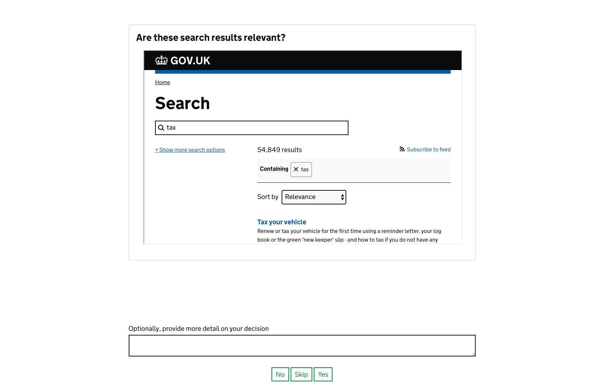

# README

Govuk Interactive Form allows you to easily pose questions to users and collect their answers in a 'fun' form




## Running

You'll need postgres and Ruby. To start it, just do:
```
bundle install
rake db:setup
rails s
```
You should then be able to visit `localhost:3000/example` to play with the example questions


## Setting up

The app a little config to set up your questions. 

* Firstly, make a YAML file with your set up and the questions you want to pose. Each question can have the following fields

| id                                           | question                           | content                                                      | iframe_url                                                   | more_detail_prompt                                                                               | key_to_show_more_detail_prompt                                                                                                   | answers                                                                                                       |
|----------------------------------------------|------------------------------------|--------------------------------------------------------------|--------------------------------------------------------------|--------------------------------------------------------------------------------------------------|----------------------------------------------------------------------------------------------------------------------------------|---------------------------------------------------------------------------------------------------------------|
| ID of the question, can be numeric or string | The question put to the user       | HTML content that will help a user decide. Can be left blank | Optional. URL to display in an iframe                        | Optional. Prompt that will be shown to users above a textarea they can enter free form text with | Optional. They key of an answer that you want to show a textarea where they can enter more information about their decision with | Array of answers a user can select from to answer the question. Each must have an entry for 'key' and 'text'  |
| 1                                            | Are these search results relevant? |                                                              | https://www.gov.uk/search/all?keywords=taxid&order=relevance | Please provide more detail on your decision                                                      |                                                                                                                                  |                                                                                                               |
|                                              | Is Ruby better than Python         | <p>Clearly, Ruby is superior.</p>                            |                                                              |                                                                                                  |                                                                                                                                  |                                                                                                               |
* The URL to access your questions will be whatever you name this file (eg `you-were-cool.yml` will result in the questions being available at `/you-were-cool`)
* Now in `config/items.yml` add a reference to your questions by adding a 
```
production:
    name-of-questions-file:
        start_page_title: "Some text to be the title of the start page for my questions"
        start_page_description: "Some HTML to be the description on the start page for my questions"
```


* Now you're ready to go! The `name-of-questions-file` key in the items yaml file will now be available as an endpoint, so in this example you'd go to `localhost:3000/name-of-questions-file`
* As users answer the questions, it'll create Answer records with all the relevant information, you can query the answers for your questions with something like `Answer.where(collection: "example")` 

## Reviewing answers

When your users have all answered the questions you've posed, there are a couple of rake tasks to export all the data.

Currently, the best way to do this is to download the postgres database from Heroku, import it into your local db and run the tasks. In the future, it may be easier for the tasks to upload the results to an AWS S3 bucket.

For the time being, download a backup of the Heroku database; either through the web interface or by following the instructions on [this guide](https://devcenter.heroku.com/articles/heroku-postgres-import-export).

Next, rename the file to 'database' and move it to the folder above your govuk-interactive-form repo folder (to prevent accidentally adding sensitive data to Git)

Run `pg_restore -h localhost -d govuk_interactive_form_development ../database` to import the database into your local PG instance (you may need to add the database and set requisite user permissions first).

Then you can run 'rake export_collection[name_for_my_questions_as_set_in_items.yml]' to export a raw csv of all the answers to your questions or 'rake export_decisions[name_for_my_questions_as_set_in_items.yml]' to get a tallied list of how many times each answer was given for each question. 

## Authentication

When the Rails environment is `production`, the application is protected by
basic authentication. You can set the user name and password by creating the two
expected environment variables on the Paas:

```
cf set-env govuk-interactive-form GOVUK_USERNAME <value>
cf set-env govuk-interactive-form GOVUK_PASSWORD <value>
```
